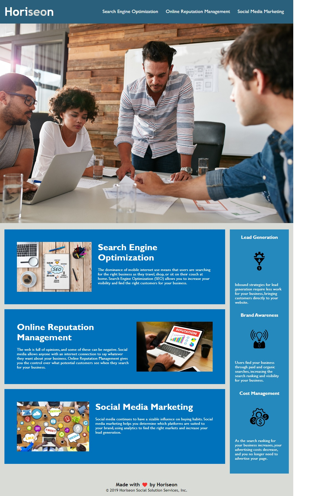

# Week01-Challenge

## Description:

Per the user story and acceptance criteria, the startup codes in the HTML and CSS files have been refactored to ensure that the webpage adheres to accessibility standards.

### Screenshot:

### Links:

https://xvrteo.github.io/Week01-Challenge/
https://github.com/XvrTeo/Week01-Challenge
